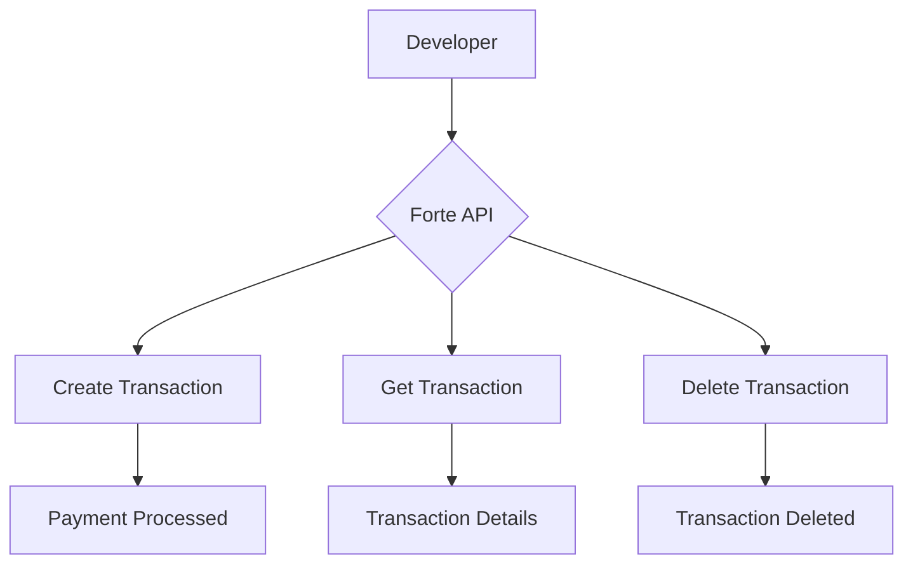

# Code & Technical

This page demonstrates the code and technical content types available in Redocly Realm.

## Basic Code Snippet

```javascript
function createTransaction(amount, cardNumber) {
  return fetch('https://api.forte.net/v3/transactions', {
    method: 'POST',
    headers: {
      'Content-Type': 'application/json',
      'Authorization': 'Bearer YOUR_API_KEY'
    },
    body: JSON.stringify({ amount, cardNumber })
  });
}
```

## Code Snippet with Title and Highlighted Lines

```javascript 
function processPayment(amount, cardNumber) {
  const payload = {
    amount: amount,
    card_number: cardNumber,
    currency: 'USD'
  };
  return fetch('https://api.forte.net/v3/transactions', {
    method: 'POST',
    body: JSON.stringify(payload)
  });
}
```

## Code Group — Multiple Languages


```js 
fetch('https://api.forte.net/v3/transactions')
  .then(response => response.json())
  .then(data => console.log(data));
```
```python 
import requests
response = requests.get('https://api.forte.net/v3/transactions')
data = response.json()
print(data)
```
```bash 
curl -X GET https://api.forte.net/v3/transactions \
  -H "Authorization: Bearer YOUR_API_KEY"
```


## File Tree

```treeview
forte-realm-demo/
├── docs/
│   ├── code/
│   │   └── code-technical.md
│   ├── visual/
│   │   └── visual-components.md
│   ├── interactive/
│   │   └── interactive-api.md
│   └── reuse/
│       └── content-reuse.md
├── openapi/
│   └── museum.yaml
├── index.md
├── redocly.yaml
└── sidebars.yaml
```

## Diagram



## Code Walkthrough


Code Walkthrough is available on Realm Enterprise and Enterprise+ plans. It is not included in the free trial.


The Code Walkthrough is one of Realm's most powerful features. It creates a **side-by-side interactive experience** where explanations on the left panel stay synchronized with code examples on the right panel as the user scrolls.

**How it works:**

- The **left panel** displays step-by-step explanations written in Markdown
- The **right panel** displays code with automatic highlighting that follows the active step
- Users can switch between multiple code files using tabs
- Authors can add interactive filters, toggles, and inputs

**Example use case for Forte:**

A developer integrating the Forte REST API would see a walkthrough like this:



Define your API key and base URL at the top of your file. Store these as environment variables — never hardcode credentials in production code.

```javascript
const API_KEY = process.env.FORTE_API_KEY;
const BASE_URL = 'https://api.forte.net/v3';
```


Create the transaction object with the required fields: amount, card number, expiration date, and CVV.

```javascript
const payload = {
  amount: 100.00,
  card_number: '4111111111111111',
  expiration_date: '12/26',
  cvv: '123',
  currency: 'USD'
};
```


Use fetch to POST to the transactions endpoint with your credentials and payload.

```javascript
const response = await fetch(`${BASE_URL}/transactions`, {
  method: 'POST',
  headers: {
    'Content-Type': 'application/json',
    'Authorization': `Bearer ${API_KEY}`
  },
  body: JSON.stringify(payload)
});
```


Check the response status. A successful transaction returns a transaction ID. Handle errors gracefully.

```javascript
const data = await response.json();

if (response.ok) {
  console.log('Approved:', data.transaction_id);
} else {
  console.error('Failed:', data.message);
}
```



For the full interactive Code Walkthrough experience with synchronized highlighting, see the [official Redocly documentation](https://redocly.com/docs/realm/content/markdoc-tags/code-walkthrough/create-code-walkthrough).