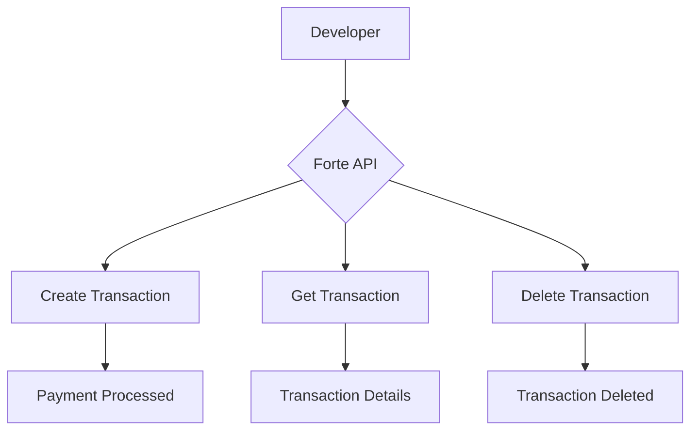

 ---
title: Code & Technical
description: Code snippets, code groups, file trees, and diagrams in Redocly Realm
---

# Code & Technical

This page demonstrates the code and technical content types available in Redocly Realm.

## Basic Code Snippet

```javascript
function createTransaction(amount, cardNumber) {
  return fetch('https://api.forte.net/v3/transactions', {
    method: 'POST',
    headers: {
      'Content-Type': 'application/json',
      'Authorization': 'Bearer YOUR_API_KEY'
    },
    body: JSON.stringify({ amount, cardNumber })
  });
}
```

## Code Snippet with Title and Highlighted Lines

```javascript 
function processPayment(amount, cardNumber) {
  const payload = {
    amount: amount,
    card_number: cardNumber,
    currency: 'USD'
  };
  return fetch('https://api.forte.net/v3/transactions', {
    method: 'POST',
    body: JSON.stringify(payload)
  });
}
```

## Code Group — Multiple Languages



fetch('https://api.forte.net/v3/transactions')
  .then(response => response.json())
  .then(data => console.log(data));


import requests
response = requests.get('https://api.forte.net/v3/transactions')
data = response.json()
print(data)


curl -X GET https://api.forte.net/v3/transactions \
  -H "Authorization: Bearer YOUR_API_KEY"



## File Tree

```treeview
forte-realm-demo/
├── docs/
│   ├── code/
│   │   └── code-technical.md
│   ├── visual/
│   │   └── visual-components.md
│   ├── interactive/
│   │   └── interactive-api.md
│   └── reuse/
│       └── content-reuse.md
├── openapi/
│   └── museum.yaml
├── index.md
├── redocly.yaml
└── sidebars.yaml
```

## Diagram



## Code Walkthrough



Start by defining the API endpoint and your authentication headers.


Create the transaction payload with the required fields: amount and card number.


Use fetch or your preferred HTTP client to send the POST request to the Forte API.


Check the response status and handle both success and error cases accordingly.



