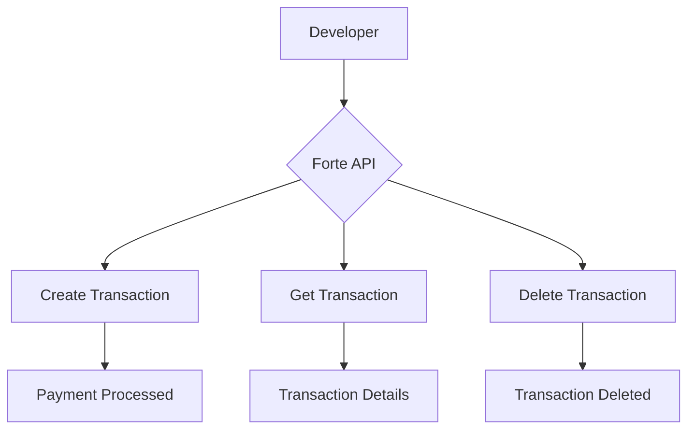

# Code & Technical

This page demonstrates the code and technical content types available in Redocly Realm.

## Basic Code Snippet

```javascript
function createTransaction(amount, cardNumber) {
  return fetch('https://api.forte.net/v3/transactions', {
    method: 'POST',
    headers: {
      'Content-Type': 'application/json',
      'Authorization': 'Bearer YOUR_API_KEY'
    },
    body: JSON.stringify({ amount, cardNumber })
  });
}
```

## Code Group — Multiple Languages


```js 
fetch('https://api.forte.net/v3/transactions')
  .then(response => response.json())
  .then(data => console.log(data));
```
```python 
import requests
response = requests.get('https://api.forte.net/v3/transactions')
data = response.json()
print(data)
```
```bash 
curl -X GET https://api.forte.net/v3/transactions \
  -H "Authorization: Bearer YOUR_API_KEY"
```


## File Tree

```treeview
forte-realm-demo/
├── docs/
│   ├── code/
│   │   └── code-technical.md
│   ├── visual/
│   │   └── visual-components.md
│   ├── interactive/
│   │   └── interactive-api.md
│   └── reuse/
│       └── content-reuse.md
├── openapi/
│   └── museum.yaml
├── index.md
├── redocly.yaml
└── sidebars.yaml
```

## Diagram

