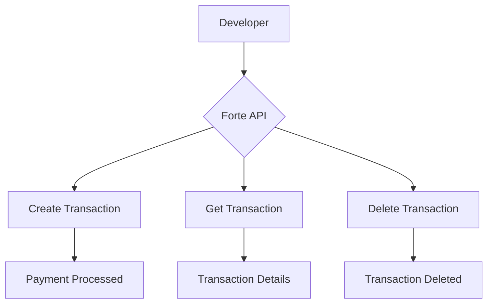

# Code & Technical

This page demonstrates the code and technical content types available in Redocly Realm.

## Basic Code Snippet

```javascript
function createTransaction(amount, cardNumber) {
  return fetch('https://api.forte.net/v3/transactions', {
    method: 'POST',
    headers: {
      'Content-Type': 'application/json',
      'Authorization': 'Bearer YOUR_API_KEY'
    },
    body: JSON.stringify({ amount, cardNumber })
  });
}
```

## Code Snippet with Title and Highlighted Lines

*Coming soon*

## Code Group — Multiple Languages


```js 
fetch('https://api.forte.net/v3/transactions')
  .then(response => response.json())
  .then(data => console.log(data));
```
```python 
import requests
response = requests.get('https://api.forte.net/v3/transactions')
data = response.json()
print(data)
```
```bash 
curl -X GET https://api.forte.net/v3/transactions \
  -H "Authorization: Bearer YOUR_API_KEY"
```


## File Tree

```treeview
forte-realm-demo/
├── docs/
│   ├── code/
│   │   └── code-technical.md
│   ├── visual/
│   │   └── visual-components.md
│   ├── interactive/
│   │   └── interactive-api.md
│   └── reuse/
│       └── content-reuse.md
├── openapi/
│   └── museum.yaml
├── index.md
├── redocly.yaml
└── sidebars.yaml
```

## Diagram



## Code Walkthrough



## How to integrate the Forte API

Follow these steps to make your first API call to Forte.


Start by defining your API key and base URL. Store these as constants at the top of your file. Never hardcode your API key in production — use environment variables instead.



Create the transaction payload with the required fields: amount, card number, expiration date, CVV, and currency. All amounts are in USD by default.



Use the fetch function to send a POST request to the transactions endpoint. Pass your headers and the JSON-encoded payload in the request body.



Check the response status. A successful transaction returns a transaction ID. If the request fails, the response includes an error message explaining what went wrong.



